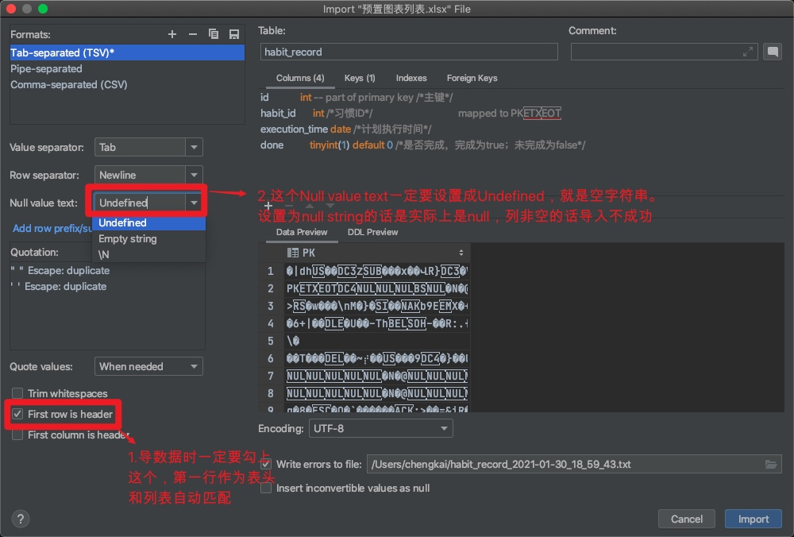

## java

### 多线程

#### 线程池 handler 拒绝策略

1. CallerRunsPolicy

   > 该策略下，在调用者线程中直接执行被拒绝任务的run方法，除非线程池已经shutdown，则直接抛弃任务。

2. AbortPolicy

   > 该策略下，直接丢弃任务，并抛出RejectedExecutionException异常。

3. DiscardPolicy

   > 该策略下，直接丢弃任务，什么都不做。

4. DiscardOldestPolicy

   > 该策略下，抛弃进入队列最早的那个任务，然后尝试把这次拒绝的任务放入队列

   

## 数据库(mysql)

## docker

### docker下安装mysql

###### 查看可用的mysqll版本

`$ docker search mysql`

###### 拉取mysql最新版本的镜像

`$ docker pull mysql:latest`

###### 查看本地镜像是否已安装mysql

`$ docker images`	

###### 运行容器

`$ docker run -itd --name mysql-localhost -p 3306:3306 -e MYSQL_ROOT_PASSWORD=123456 mysql` 

###### 查看是否安装成功

`$ docker ps`

###### 进入容器

`$ docker exec -it ac9fdd1e17c6 bash`

> ac9fdd1e17c6为容器id

###### 登录mysql

`root@ac9fdd1e17c6:/# mysql -u root -p`

###### 配置文件和数据文件地址

```
$ cd /root/mysql/etc:/etc/mysql # mysql配置文件位置
$ cd /root/mysql/data:/var/lib/mysql # mysql数据文件位置
```

###### 用户密码

root/123456

### docker下修改postgresql的密码

###### 进入容器

`$ docker exec -it 480ed4ef8ad1 bash`

> 480ed4ef8ad1为CONTAINER ID

###### 使用postgres登录

`$ su postgres`

###### 连接数据库

`$  psql -U postgres`

###### 修改postgresql用户密码

`$ alter user postgres with password '123456'`

###### 退出数据库连接

`$  \q`

###### 用户密码

postgres/postgres


## 问题

###### dataGrip 导数据非空校验



